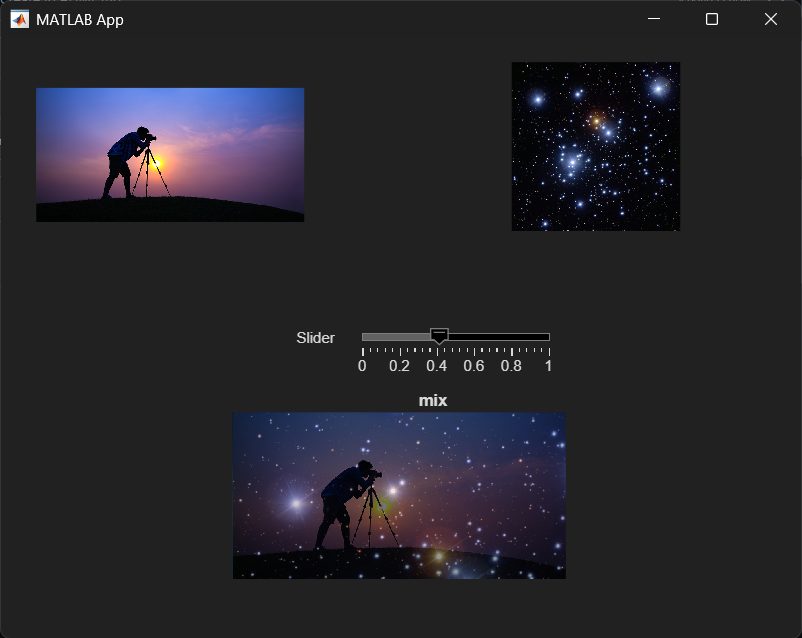

# Lab 03 — Point Operations & Geometric Transformations

  MATLAB implementations of fundamental image processing operations developed without relying on high-level Image Processing Toolbox functions.

  The goal of this project is to understand the mathematical foundations of image manipulation through manual pixel-level implementations.

## Implemented Operations

### Point Operations
Brightness adjustment
Multiplication-based intensity scaling
Square-root intensity transformation
Saturated normalization
Min-max normalization

### Image Mixing

Weighted image blending using:

$$Result = k \cdot Im_1 + (1 - k) \cdot Im_2$$

### Geometric Transformations

Horizontal mirroring
Image scaling
Rotation around image center
Affine-style 90° rotation

All transformations were implemented manually using coordinate mapping and pixel-wise operations.

## Interactive GUI

A custom GUI was developed using MATLAB App Designer.

### Features:

Real-time image blending
Adjustable mixing coefficient
Side-by-side visualization
Interactive testing environment

## Technical Focus

### This project emphasizes:

Pixel-level image processing
Coordinate transformations
Boundary checking
Data type handling (uint8, double)
Manual implementation of geometric operations

## Files

exercise3.m   -> Core image processing functions
app1.mlapp    -> Interactive GUI
img.jpg       -> Input image
star.jpg      -> Input image
Environment
MATLAB
MATLAB App Designer
Notes

The algorithms were intentionally implemented using loops and manual coordinate manipulation for educational purposes.

Built-in functions such as imrotate and imresize were intentionally avoided.

Developed during the Image Processing & Recognition course at Czestochowa University of Technology.
